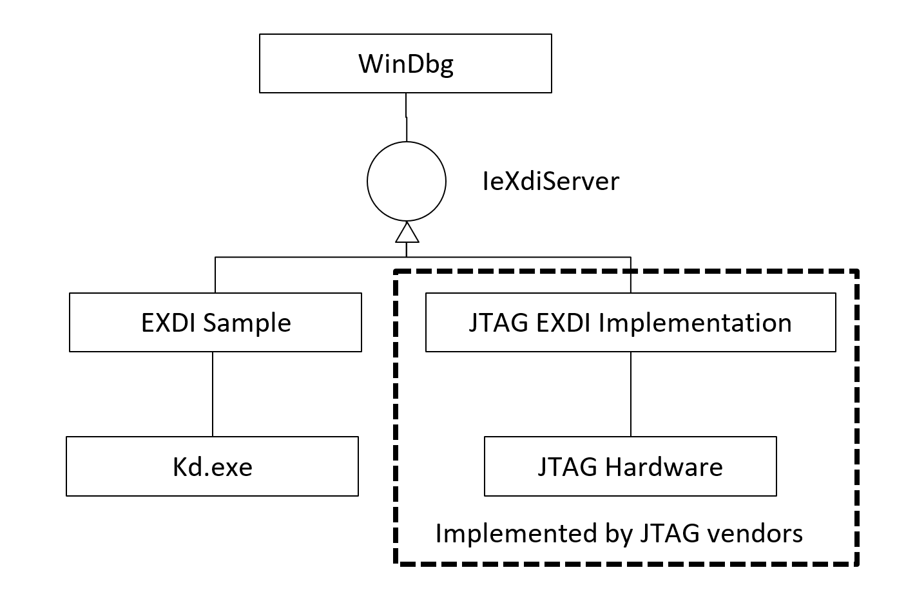
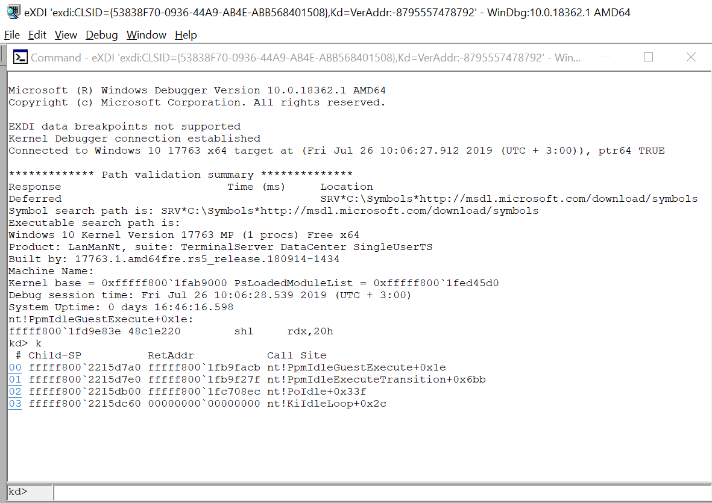
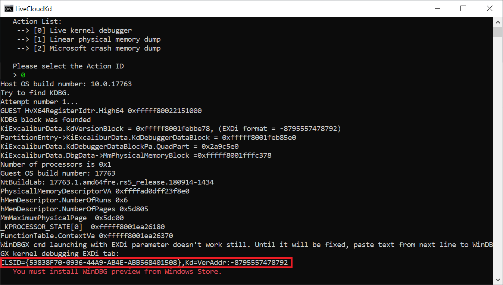
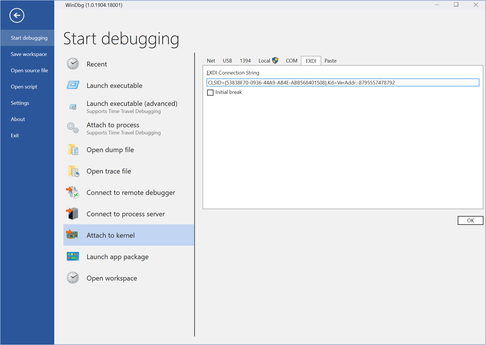

This project is modified EXDPlugins example from WindDBG SDK
(C:\Program Files (x86)\Windows Kits\10\Debuggers\x64\sdk\samples\exdi\ExdiKdSample)

It uses LiveCloudKdSdk library for reading and writing memory operations, get registers.

There is readme.docx in ExdiKdSample project win WinDBG SDK directory, which described architecture of EXDi interface. If shortly
EXDI is an interface that allows extending WinDbg by adding support for hardware debuggers. We haven't hardware debuggers for Hyper-V, but we can add to EXDi interface LiveCloudKdSdk functions calling

For installation: 

1. Copy LiveCloudKdSdk.exe, LiveCloudKdSdk.dll, hvmm.sys, vidaux.dll (only for ReadInterfaceVidAux method) and ExdiKdSample.dll to WinDBG x64 directory
2. Register ExdiKdSample.dll using regsvr32.exe ExdiKdSample.dll command
3. Start LiveCloudKd with -w option: LiveCloudKd.exe /w. It is automatically launch WinDBG with EXDi interface.

You can use WinDBG Preview with EXDi plugin too. But WinDBGx has bug with automatically starting EXDi plugin from command line, there it must be start manually.

1. Launch LiveCloudKd.exe /x.
2. Copy string, which provide LiveCloudKd 

3. start WinDBGX, go to File-Start debugging-Attach to Kernel, open EXDi tab and paste string to field.

4. You can read\write to guest OS memory and execute WinDBG command, that works for dump files. Remember, that it is static plugin example, and you can't do single step (F11, F8) or running commands (F5).

